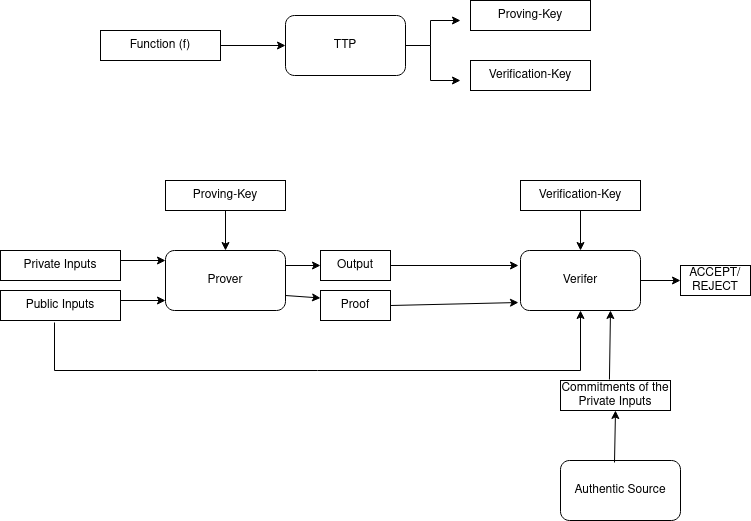

# Incremental and Privacy Preserving for Software Supply Chain
## 🗂️ Table of Contents

- 🎯 [Objective of the Project](#--objective-of-the-project) 
  - 🛡️ [The Basic Idea of in-Toto's SSC-Security Verification](#%EF%B8%8F-the-basic-idea-of-in-totos-ssc-security-verification-)  
  - 🧠 [Brief Background of ZKP System](#-brief-background-of-zkp-system-)
  - 🛠️ [Role of Circom and SNARKJS Tools in Implementing a ZKP System](#%EF%B8%8F-role-of-circom-and-snarkjs-tools-in-implementing-a-zkp-system-)
  - 💡 [Our Proposed Idea](#-our-proposed-idea-)  
  - 🧪 [What We Have Implemented in This Prototype Version](#--what-we-have-implemented-in-this-prototype-version)

- 📁 [Project Structure](#-project-structure)

- ⚙️ [Prerequisite](#%EF%B8%8F-prerequisite-)

- 🚀 [How to Use this Repository](#-how-to-use-this-repository-)  
  - 🧱 [Compile the Main Circuit](#-compile-the-main-circuit-)  
  - 🧾 [Prepare Input for the Circom Circuit from layoutjson and linkmetadatajson](#-prepare-input-for-the-circom-circuit-from-the-layoutjson-and-linkmetadatajson-)  
  - 🧮 [Generate Witness](#generate-witness-)

- 🔮 [Possible Future Extensions of this Work](#-possible-future-extensions-of-this-work-)
  
- 📚 [References](#-references-)

- 📬 [Contact](#-contact-)

- 🙌 [Credits](#-credits-)


## 🎯  Objective of the Project

Prototype implementation of a privacy preserving (zero-knowledge) version of the in-toto Software Supply Chain (SSC) Security Verification using Circom and SNARKJS tools. 

### 🛡️ The basic idea of in-Toto's SSC-Security verification:-

[🔝 Back to Top](#)

- A s/w development project involves a **Project Manager** (PM) and a set of **Functionaries** authorized by the PM
- The PM defines the **layout** of the project
- The layout lists the **steps** involved in the project and the following information regaring each step:-
  - **name**: name of the step
  - **expected commands**: describing the suggested command to run for generating the output of this step
  - **expected materials**: a set of **artifact-rules** describing what are allowed and what are not allowed as the inputs to this step
  - **expected products**: a set of **artifact-rules** describing what are allowed and what are not allowed as the outputs from this step
  - **Public-Key**: of the functionary authorized for the step
- The layout is signed by the PM using its Private-Key
- Each functionary, after completion of its step, generates a **Link-Metadata** document signed by its own private-key
- The link metadata contains the following information:-
  - **name**: name of the step
  - **link command**: the commands that has been used in this step
  - **link materials**: list of all artifacts (filenames with their full path and hash digests) that has been used as the inputs to this step
  - **link products**: list of all artifacts that were generated as the outputs of this step
- The **artifact-rules** mentioned in the layout:-
  - connects steps together through their materials or products
  - enforces the existence of certain artifacts within a step
  - authorize operations on artifacts etc.
- There are 7 types of artifact-rules defined by in-toto framework, viz., MATCH, CREATE, DELETE, MODIFY, ALLOW, REQUIRE, and DISALLOW.
- Here, we brief only the three rules which we have implemented in this prototype:-
  - REQUIRE Rule: ​indicates that a pattern ​must​ appear as a material or product of a step.
  - CREATE Rule: indicates that products matched by the pattern ​must not​ appear as materials of some step. Note, the rule still passes if the pattern does not match any products of the step.
  - DISALLOW Rule: indicates that no files matching a pattern can appear as a material or a product on this step.
- The **end-client**, upon receiving all the signed Link-Metadata documents along with the signed Layout, performs the following checks:-
  - Verifies the signature on the Layout using the Public-Key of the PM (assuming that PM is fully trusted by the end-client and it's public key is already available to the client).
  - Extracts the public keys of all the functionaries corresponding to all stpes from the verified layout.
  - Verifies the signature on each link-metadata document using the authentic public-key of the corresponding functionary
  - Verifies whether the commands, materials and products of each step, as reported in the corresponding link-metadata, comply with the specifications described in the layout or not.
- If the above verification is successful, the end-client gets the assurance that the software delivered to it has come through a secure supply chain.
  
For more details, please go through [this](./Documentation/in-toto-spec.pdf)

### 🧠 Brief Background of ZKP System:-

[🔝 Back to Top](#)

- A zero-knowledge proof system (ZKP) involves three types of entities, viz., **prover**, **verifier** and a **trusted third party** (TTP)
- A ZKP also involves a **Computation** which is some arbitrary function / algorithm ($f$)
- The inputs to the function $f$ are of two types, viz., **public inputs** and **private inputs**
- The public inputs are shared by the prover with the verifier, while the private inputs are kept secret only to the prover
- The public inputs must include some **commitments** (usually hash) of the private inputs used in the computation
- The verifier receives the commitments of the private inputs through some authentic / trusted channel
- The TTP generates a key-pair corresponding to the computation functions $f$
- The key-pair consists of a **proving-key** - which is used by the prover, and a **verification-key** - used by the verifier
- The prover generates the output of the computation ($f$) along with a proof $$\pi$$
- The output along with the proof  $$\pi$$ is sent to the verifier
- The **soundness** property of the ZKP system ensures that the verification will be successful only when the computation has been done correctly using the given public inputs
- The **zero-knowledge** property of the ZKP system ensures that no information can be retrieved regarding the private inputs used in the computation from either the public inputs or the proof $$\pi$$.
- The ZKP concept is elaborated by the following figure:-

  <p align="center">
    
  </p>


  
### 🛠️ Role of Circom and SNARKJS Tools in Implementing a ZKP System:-

[🔝 Back to Top](#)

- Circom provides an way to define an arbitrary computation ($f$) in a high-level programming language (circom language)
- In addition to defining the logic of the computation algorithm , we can define which inputs will be public and which will be private using this language's constructs
- Circom compiler generates an R1CS file which is a Matrix representation of the defined computation algorithm ($f$)
- The R1CS file is given as the input to the SNARKJS tool-chain
- The SNARKJS tool is used in three phases, viz., **Setup Phase**, **Proof Generation Phase** and the **Verification Phase**
  - The Setup Phase takes the R1CS file and generates a Prover-Key, Verification-Key pair corresponding to it
  - The Proof Generation Phase is further executed in two steps, viz., **Witness Generation Phase** and **Final Proof Generation Phase**
    - The **Witness Generation Phase** takes the R1CS file and the inputs to the computation (both public and private inputs) and produces an Extended Witness Vector
      - The Inputs to this phase are supplied in a JSON file
      - The Extended Witness Vector contains all the given input values, the generated output values along with the results of all intermediate calculations
    - The **Final Proof Generation Phase** takes the generated Witness file and the prover-key and generates two files - Public.JSON and Proof.JSON
      - The Public.JSON contains all the public inputs along with the outputs of the computation
      - The Proof.JOSN contains the cryptographic proof of correctness of the computation
  - The **Verification Phase** takes Public.JSON, Proof.JSON and the Verification-Key to verify. It results in ACCEPTANCE if everything is OK,REJECT otherwise
- SNARKJS tool currently supports three cryptographic protocols for the generation of the proof, viz., Groth16, Plonk and Fflonk protocol

### 💡 Our Proposed Idea:-

[🔝 Back to Top](#)

We acheive the same objective as defined by in-toto framework without disclosing either the Layout or the Link-Metadata contents to the end-user. This way we can ensure the SSC security while preserving the pivacy of a software firm. We use ZKP for this purpose. The details are as follows:-

- **Private Inputs**: The actual Layout file and all the Link-Metadata files
- **Commitments to Private Inputs**: Merkle-Root Hashes of the Layout file and Link-Metadata files
- **Note**: there is no other Public Inputs besides the commitments to private inputs
- **What the Computation Function genertates as output?**
  - A boolean value to indicate whether the given Layout data matches with the given Merkle-Root Hash of the layout file
  - A boolean value to indicate whether the given Link-Metadata matches with the given Merkle-Root Hash of the Link-Metadata file
  - A boolean value to indicate whether the given Link-Metadata is compliant with the given Layout data (according to in-Toto logic described above)
    
- **Who is the Prover?**: the s/w development firm
- **Who is the Verifier?**: the end-user (Client)
- **Who is the TTP?**: Any globally trusted third party or, blockchain. Note that the private inputs are not disclosed to the TTP. It only generates the proving-key and verificationkey from a specific computation function $f$.
  
- **How does the Verifier (end-user) gets the commitments to private inputs (Merkle-Root Hashes of the Layout file and Link-Metadata files)?**
  - The PM signs the following information using it's private-key and sends to the client
    - The names of all steps and the public-keys of the authorized functionary for each step
    - The Merkle-Root Hash of the Layout Data (the data itself is not shared with the client)
  - The client fully trusts the PM and already holds the public-key of the PM (same assumption as in original in-Toto)
  - Client verifies the above information using the PM's public key
  - Each functionary signs the Merkle-Root Hash of the Link-Metadata (the metadata itself is not shared with the client) of the corresponding step
  - The signed Merkle-Root Hashes of all the Link-Metadata are also sent to the client
  - Client verifies the signatures and receives the authentic Merke-Root hases of all link-metadata

### 🧪  What we have Implemented in this Prototype Version?

[🔝 Back to Top](#)

- We have written JavaScripts programs:-
  - to translate the key values in the layout and link-metadata files from strings to Field elements in $Z_p$ (recognized by circom)
  - to calculate the Merkle-Root Hashes of a translated layout and  link-metadata file

- We have written the circom circuits to perform the above verifications. Our prototype implementation takes a simplest version of the in-toto framework, in which:-
  - Number of material rules and product rules allowed in Layout file are constant (three)
  - Number of link-materials and link-products in a LinkMetadata file can be upto max. 5
  - Implemented only the REQUIRE, CREATE and DISALLOW rules
  - DISALLOW rule has been implemented only for products (not for materials)
  - Implemented only DISALLOW * (disallow star) pattern
  
- Digital Signature generation and verification is not part of this project - whcih can be achieved using any standard crypto. library or tool

## 📁 Project Structure

[🔝 Back to Top](#)

```

zk-SSC-Security-Verification/
├── Assets/              # Contains the JS progs required for preprocessing of the Layout and LinkMetadata files.
│   ├── LayoutToInt.js      # Converts each value of 'Layout.json' file (kept at the root dir) 
│   │                         into a prime field element. Produces 'LayoutToInt.json'
│   ├── LinkMetaToInt.js    # Converts each value of 'LinkMetadata.json' file (kept at the root dir) 
│   │                         into a prime field element. Produces 'LinkToInt.json'
│   ├── LayoutHasher.js     # Appends the Merkle-Root of all fields of 'LayoutToInt.json' at its end.
│   │                         Produces 'LayoutWithHash.json'
│   ├── LinkHasher.js       # Appends the Merkle-Root of all fields of 'LinkToInt.json' at its end.
│   │                         Produces 'LinkWithHash.json'
│   └── Merger.js           # Merges 'LayoutWithHash.json' and 'LinkWithHash.json'.
│                             Produces 'CircomInput.json' (kept at the root dir)
├── Documentation/
├── Rules/
│   ├── REQUIRE.circom    # zk-Circuit template implementing the core logic of the 'REQUIRE' rule checking.
│   ├── CREATE.circom     # zk-Circuit template implementing the core logic of the 'CREATE' rule checking.
│   └── DISALLOW.circom   # zk-Circuit template implementing the core logic of the 'DISALLOW' rule checking.
├── Sampl Inputs/
│   ├── Require/          # Sample 'Layout.json' and 'LinkMetadata.json' files for REQUIRE rule testing
│   ├── Create/           # Sample 'Layout.json' and 'LinkMetadata.json' files for CREATE rule testing
│   └── Disallow/         # Sample 'Layout.json' and 'LinkMetadata.json' files for DISALLOW rule testing
├── FinalCircuit.circom   # The main Circom Circuit - performs the following verifications:-
│                           - Verifies the integrity of the given Layout data against the given 'LayoutHash' (Merkle-root)
│                           - Verifies the integrity of the given Link metadata against the given 'LinkHash' (Merkle-root)
│                           - Verifies the given Link metadata against the given Layout data
├── CircomInput.json      # Input to the 'FinalCircuit.circom'. Contains:-
│                            - Layout data (all values mapped to field elements in Zp)
│                            - Link metadata (all values mapped to field elements in Zp)
│                            - LayoutHash (Merkle-root of layout data) 
│                            - LinkHash (Merkle-root of link metadata)
├── zkSCV-Utils.circom    # The necessary utility zk-Circuit temaplates (such as Merkle-Root calculation etc.) 
├── Layout.json           # A Simplifiled Layout File (asuming only one 'step')
├── LinkMetadata.json     # A Simplifiled LinkMetadata File 
├── ProcessInputs.sh      # A SHELL script that takes 'Layout.json' and 'LinkMetadata.json' as inputs
│                           and produces 'CircomInput.json' as output (by executing the progs kept at Assets/ dir)
├── LICENSE
└── README.md
```

## ⚙️ Prerequisite:-

[🔝 Back to Top](#)

- UNIX OS (Ubuntu)
- NodeJS (Version 16.x or higher) [Click here](https://nodejs.org/en)
- SNARKJS (`npm install -g snarkjs`)
- Circom [Click here](https://docs.circom.io/getting-started/installation/)
- Circomlib [Click here](https://github.com/iden3/circomlib.git)
  
## 🚀 How to Use this Repository:-

### 🧱 Compile the Main Circuit:-

[🔝 Back to Top](#)

```circom FinalCircuit.circom --r1cs --wasm --sym -l /home/smaity/```

**NOTE:**  Replace "/home/smaity/" by the actual path to your "circomlib" directory.

### 🧾 Prepare Input for the Circom Circuit from the Layout.json and LinkMetadata.json:-

[🔝 Back to Top](#)

```
  chmod +x ProcessInputs.sh
  ./ProcessInputs.sh
```
This will generate `CircomInput.json`

### 🧮Generate Witness:-

[🔝 Back to Top](#)

- Run the followin command:-

  ```node FinalCircuit_js/generate_witness.js FinalCircuit_js/FinalCircuit.wasm CircomInput.json witness.wtns```

- It will show some output like the following on terminal:-

```bash
  Calculated Layout Hash =  20540048456084753879029050922680988864439249708240270261959362195829413678886
  Layout hash matches =  1
  Calculated LinkHash =  9957377598862575408318984021864293408479542956279911650074625692520483945610
  LinkHashMatches =  1
  materialcheck =  1
  productcheck =  1
  valid =  1
```
- You may check the following:-

  -  the `Calculated LayoutHash` and `Calculated LinkHash` are the same as those values given inside the `CircomInput.json`
  - `Layout hash matches` and `LinkHashMatches` values will be `1` only if the above two matches; `0` otherwise
  - `materialcheck` value will be `1` only if `LinkMetadata.json` does not violate any of the "expected_materials" rules mentioned in the `Layout.json`; `0` otherwise
  - `productcheck` value will be `1` only if `LinkMetadata.json` does not violate any of the "expected_products" rules mentioned in the `Layout.json`; `0` otherwise
  - `valid` value will be `1` only if both `materialcheck` and `productcheck` values are `1`; `0` otherwise

- The above output of the zk-Prover are included in the generated witness file `witness.wtns`
- You can do experiments by modifying the content of the `Layout.json` and `LinkMetadata.json` files. Sample inputes are given inside the "Sampl Inputs" directory.

## 📚 Possible Future Extensions of this Work:-

[🔝 Back to Top](#)

- making the Circom templates generic so that it can take any number of expected_materials in a layout file
- making the Circom templates generic so that it can take any number of link_materials and link_products in a link-metadata file
- adding templates for implementing the other artifact rules - MATCH, DELETE, MODIFY, ALLOW. Specifically implementing MATCH rule is challenging considering its complex logic.
- extending the DIALLOW template to make it generic so that it can work for any pattern
- implementing all the computations (circuits, proof generation and proof verification) in Rust instead of Circom + SnarkJS so that the process executes much faster when the input size is very large
- implementing aggregate proof-generation for multiple link-metadata files - requires recursive SNARK : not possible in Circom + SnarkJS : requires implementation in Rust
 

## 📚 References:-

[🔝 Back to Top](#)

- In-Toto Example Layout and Metadata. [Click here](https://in-toto.github.io/examples/debian.html)
- Background in Zero-Knowledge Protocols. [Click here](https://docs.circom.io/background/background/)

## 📬 Contact:-

[🔝 Back to Top](#)

For any query please send your email at soumya at ieee dot org

## 🙌 Credits:-

[🔝 Back to Top](#)

- SHALINI TS (Developer)
- JUNAID ALAM (Coordinator)
- DR. SOUMYADEV MAITY (Mentor)
- DR. TRISHANK KARTHIK KUPPUSAMY (Mentor)


